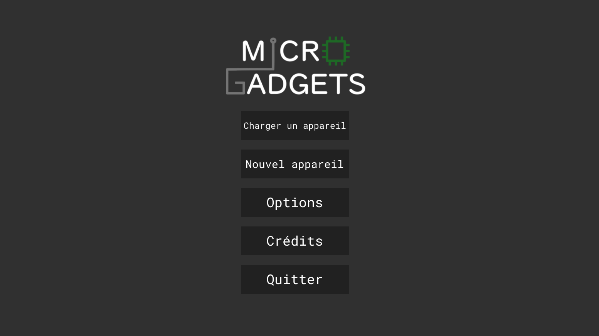
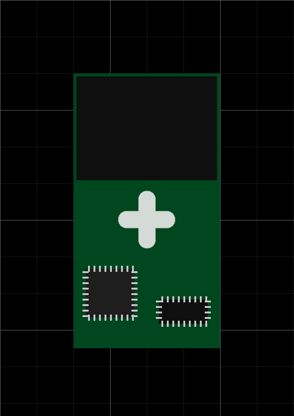
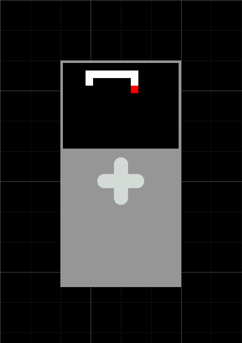
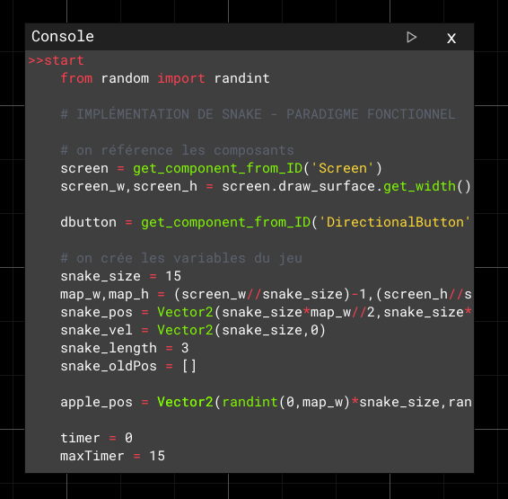

<h1 align="center">MICRO GADGETS</h1>

Micro Gadgets est un simulateur d'objets programmables. Des composants peuvent être ajoutés, déplacés et liés entre eux pour créer la structure d'une machine, qui est ensuite programmable en python. Certaines machines préconstruites sont disponibles dans le jeu.

----
 

<h2>Prérequis</h2>
  
Ce jeu est développé en Python, il est donc nécessaire de l'avoir installé. Le projet est programmé en Python et utilise principalement la bibliothèque Pygame (www.pygame.org) qu'il faut préalablement installer. La bibliothèque yaml est aussi indispensable.   > pip install pygame   > pip install pyyaml

 

<h2>Je n'arrive pas à lancer Micro Gadgets, que faire ?</h2>
  
Si vous n'arrivez pas à lancer Micro Gadgets depuis main.py, vous avez la possibilité de télécharger le fichier .exe à mettre au même niveau que main.py. Pour télécharger l'exécutable, <a href=https://drive.google.com/file/d/1Jto_N2KYLI7EhA19TxMnu7m-MXF-Wk5L/view?usp=share_link>cliquez ici.</a>

 

<h2>Projet dédié aux Trophées NSI 🏆</h2>

Nous avons développé ce logiciel à l'occasion des <a href='https://trophees-nsi.fr/'>Trophées NSI 2023</a>.

 

<h2>Gallerie</h2>

  
  

 

<h2>Licence</h2>

Le programme est placé sous la licence publique générale GNU version 3+.
