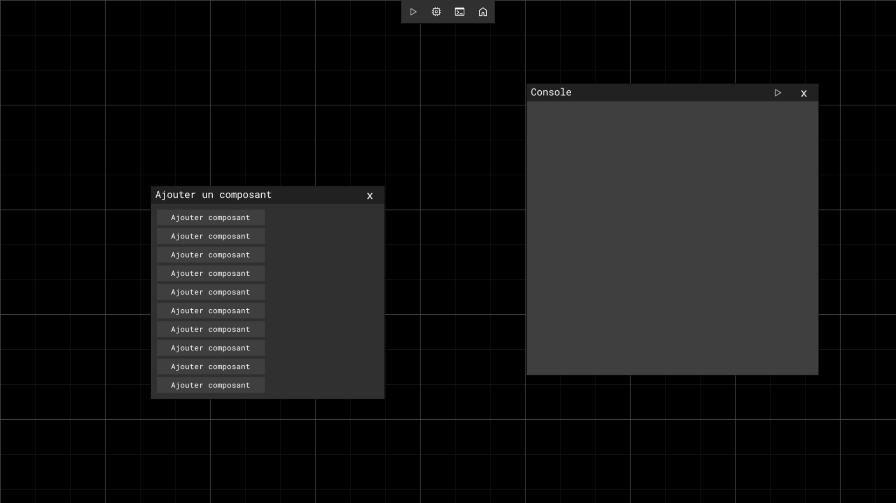
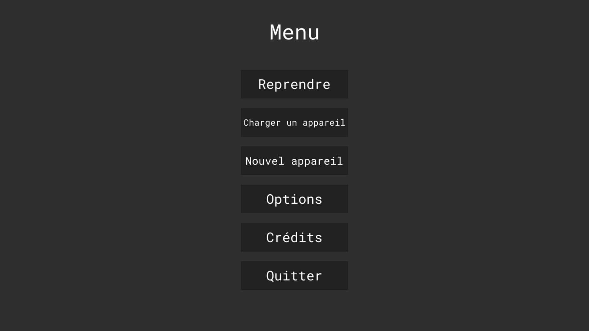

<h1 align="center">Micro Gadgets</h1>

Micro Gadgets est un simulateur d'objets programmables. Des composants peuvent être ajoutés, déplacés et liés entre eux pour créer la structure d'une machine, qui est ensuite programmable en python. Certaines machines préconstruites sont disponibles dans le jeu.

----

<h2>Prérequis</h2>
  
Ce jeu est développé en Python, il est donc nécessaire de l'avoir installé. Le projet est programmé en Python et utilise principalement la bibliothèque Pygame (www.pygame.org) qu'il faut préalablement installer. La bibliothèque yaml est aussi indispensable.   - pip install pygame   - pip install pyyaml

<h2>Bibliothèques non intégrées à Python</h2>
  
Les bibliothèques non intégrées à Python, et qu'il faut donc installer soit même, sont les bibliothèques pygame et pyyaml. La bibliothèques pyperclip est aussi utilisée mais est intégrée au projet (license incluse).
<h2>Images</h2>

<h2>Projet pour les Trophées NSI</h2>

Nous avons créé ce jeu pour les <a href='https://trophees-nsi.fr/'>trophées NSI 2023</a>

<h2>Licence</h2>

Le programme est placé sous la licence publique générale GNU version 3+.
